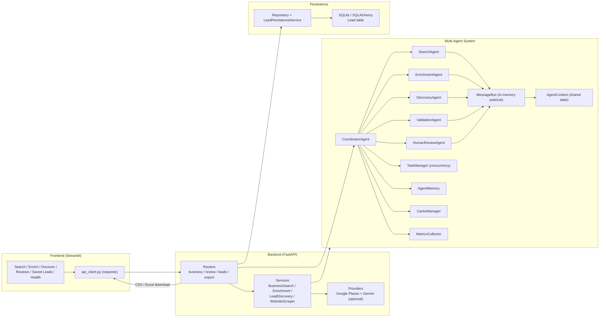
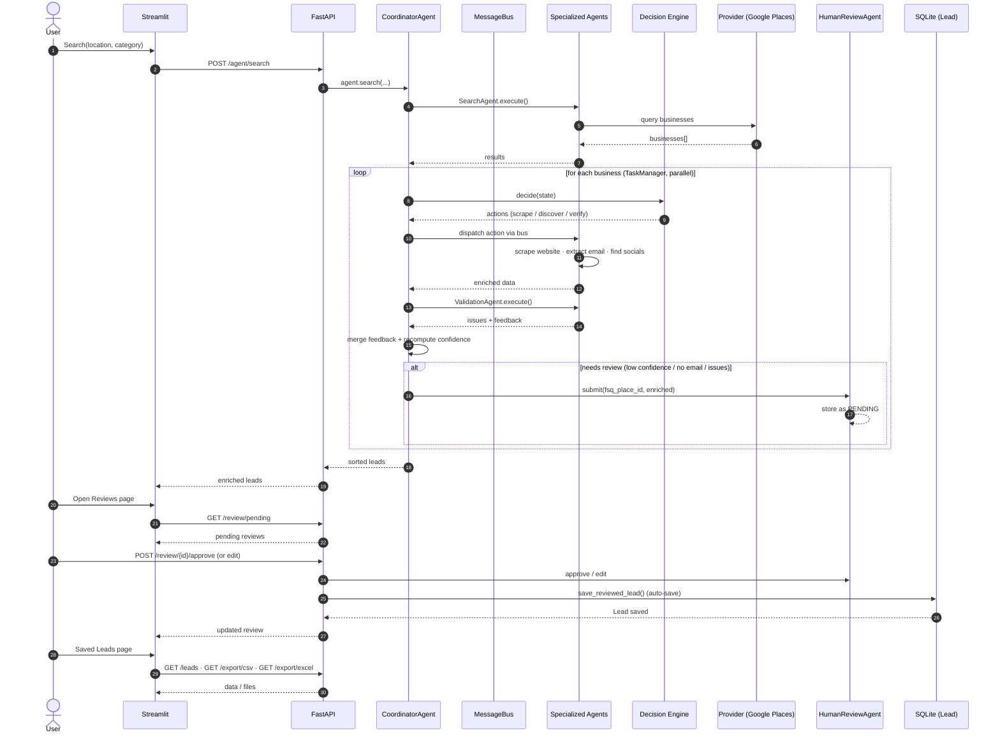

# Architecture

This document describes how the Business Lead Finder is built and how a lead
flows through the system.

- [Architecture diagram](#architecture-diagram)
- [Workflow diagram](#workflow-diagram)
- [Component descriptions](#component-descriptions)
- [Data flow: end to end](#data-flow-end-to-end)

---

## Architecture Diagram



### Plain-text version

```
                          ┌──────────────────────────────────┐
                          │        Streamlit Frontend        │
                          │  Search / Enrich / Discover /    │
                          │  Reviews / Saved Leads / Health  │
                          └───────────────┬──────────────────┘
                                          │ api_client.py (HTTP)
                                          ▼
                          ┌──────────────────────────────────┐
                          │             FastAPI              │
                          │  Routers: business · review      │
                          │           leads · export         │
                          └──────┬───────────────┬───────────┘
                                 │               │
                    services     │               │  persist (SQLite)
                    + provider   │               ▼
                                 │   ┌──────────────────────┐
                                 │   │ LeadPersistenceService│──▶ SQLite
                                 │   │  + repository (CRUD)  │    (Lead)
                                 ▼   └──────────────────────┘
                 ┌───────────────────────────────┐
                 │      CoordinatorAgent         │
                 └───┬────┬────┬────┬────┬───────┘
                     │    │    │    │    │
                     ▼    ▼    ▼    ▼    ▼
               Search  Enrich Discover Validate HumanReview
               Agent   Agent   Agent   Agent   Agent
                     │    │    │    │    │
                     └────┴────┴────┴────┘
                          │
                    MessageBus + AgentContext
                    TaskManager · Memory · Cache · Metrics
```

---

## Workflow Diagram



### Workflow summary (text)

1. **Search** — `SearchAgent` queries the Google Places provider for businesses.
2. **Enrich** — `CoordinatorAgent` runs a decision engine that picks actions
   (scrape website, extract email, discover social profiles) and dispatches
   them to `EnrichmentAgent` / `DiscoveryAgent` over the message bus, in
   parallel via `TaskManager`.
3. **Validate** — `ValidationAgent` checks the enriched lead; feedback is merged
   and the confidence score is recomputed.
4. **Review gate** — if confidence < 0.7, or the lead has no email/website, or
   validation raised issues, the lead is submitted to `HumanReviewAgent` as
   PENDING.
5. **Human review** — an operator approves, rejects, or edits the lead from the
   Reviews page.
6. **Persist** — approve/edit auto-saves the lead to SQLite via
   `LeadPersistenceService`.
7. **Export** — saved leads can be filtered, exported to CSV/Excel, or deleted
   from the Saved Leads page.

---

## Component Descriptions

### Multi-agent system (`app/agents/`)

| Component | Responsibility |
|-----------|----------------|
| `CoordinatorAgent` | Orchestrates the full pipeline; owns context, bus, memory, cache, task manager; routes leads to review when needed. |
| `SearchAgent` | Runs the provider search and returns business records. |
| `EnrichmentAgent` | Scrapes websites and extracts emails/contact info. |
| `DiscoveryAgent` | Discovers social profiles (LinkedIn, Facebook, Instagram, Twitter, YouTube) and verifies websites. |
| `ValidationAgent` | Validates enriched data, returns issues and corrective feedback. |
| `HumanReviewAgent` | Manages the review queue (pending/approved/rejected/edited) and review history. |
| `MessageBus` | In-memory pub/sub for agent-to-agent messaging; request/response correlation; wildcard `*` events. |
| `AgentContext` | Thread-safe shared state updated from agent events. |
| `TaskManager` | Runs per-lead tasks concurrently (respects `MAX_CONCURRENT_TASKS`). |
| `AgentMemory` | Stores per-business enrichment/validation facts. |

### Decision engines (`app/agents/decision_engine.py`)

- `RuleBasedDecisionEngine` — deterministic rules (default).
- `GeminiDecisionEngine` — LLM-based decisions when `GEMINI_API_KEY` is set.

### Services (`app/services/`)

- `BusinessSearchService` — provider abstraction and search orchestration.
- `EnrichmentService` — website scraping + enrichment.
- `LeadDiscoveryService` — social-profile discovery.
- `WebsiteScraperService` — HTTP scraping with retries.
- `LeadPersistenceService` — converts approved/edited review data into `Lead`
  records (upsert) and updates metrics.

### Persistence (`app/db/`)

- `database.py` — engine/session factory, `init_db()`, FastAPI `get_db` dependency.
- `models.py` — SQLAlchemy `Lead` model.
- `repository.py` — CRUD, search/filter, pagination, stats.

### Observability

- `MetricsCollector` — thread-safe counters, timing averages, tool stats,
  cache-hit and success rates; exposed via `GET /metrics`.
- Structured logging with `[Component]` prefixes for grep-able traces.

---

## Data Flow: End to End

```
HTTP request
   │
   ▼
Routers (validation + error mapping)
   │
   ▼
CoordinatorAgent.search()            ─── Decision Engine ───┐
   │                                                         │
   ├── SearchAgent ──▶ Google Places API                     │
   ├── TaskManager.run(businesses)                          │
   │     └── per lead:                                       │
   │         decision → actions                              │
   │         ─▶ EnrichmentAgent / DiscoveryAgent (via bus)   │
   │         ─▶ ValidationAgent                              │
   │         ─▶ merge feedback, confidence                   │
   │         ─▶ (maybe) HumanReviewAgent.submit()            │
   │                                                         │
   └── sorted, enriched leads ───────────────────────────────┘
   │
   ▼
Review (approve/edit) ──▶ LeadPersistenceService ──▶ SQLite
   │
   ▼
Saved Leads page / CSV / Excel export
```
